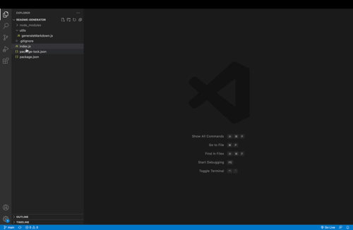

# README-GENERATOR

## Description
The goal of this project is to create an easy-to-use ReadMe generator that can be applied to most projects. The outline is provided so users can easily input data and create a professional ReadMe.

## Table of Contents 
-[Installation](#installation) 
-[Usage](#usage) 
-[License](#license) 
-[Contributing](#contributing) 
-[Tests](#tests) 
-[Questions](#questions) 

## Installation
Users can fork the README-GENERATOR and clone into their personal  directories. Node and inquirer are required to run.

## Usage
Every project should include a thorough ReadMe. This project allows a markdown file to be created quiclkly and professionaly.  Having a  consistent looking ReadMe  for all projects will create a more professional looking repo.

## License
MIT

## Contributing
Please reach out directly. See "Questions". 

## Tests
npm test

## Questions
To view my projects, please visit https://github.com/adodt.
For questions regarding this project, contact me directly at allidodt@gmail.com.

